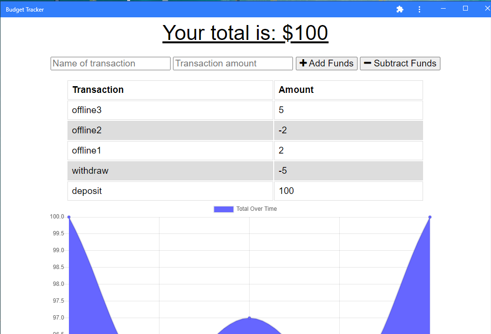

# Budget Tracker Application

## Purpose of application
Giving users a fast and easy way to track their money online as well as when user is offline i.e user should be able to access application and perform transaction even when they are not conneted to internet.

## Description
The budget tracker application allows user for offline access and functionality. The user will be able to add expenses and deposits to their budget with or without a internet connection. If the user enters transactions offline, the total will be updated when they're brought back online.Application is build using 
* express.js for routing  
* mongoDB backend to store transactions  
* IndexedDB to add offline functionality to save transactions  
* Service worker (Service workers enable applications to control network requests, cache those requests to improve performance, and provide offline access to cached content.  
* Web manifest (The web app manifest is a JSON file that tells the browser about your Progressive Web App and how it should behave when installed on the user's desktop.  

```
## User story  
AS AN avid traveler  
I WANT to be able to track my withdrawals and deposits with or without a data/internet connection  
SO THAT my account balance is accurate when I am traveling   
```

```
## Acceptance crieteria  
GIVEN a budget tracker without an internet connection  
WHEN the user inputs an expense or deposit  
THEN they will receive a notification that they have added an expense or deposit  
WHEN the user reestablishes an internet connection  
THEN the deposits or expenses added while they were offline are added to their transaction   history and their totals are updated  
```

## Installation
Use following commands to install required packages: or run ```npm install``` to install packages using given package.json file.

* npm init : Create package.json file and add dependencies and version once added.
* npm i express : To install express.js package for routing.
* npm i mongoose : Mongoose is a MongoDB object modeling tool designed to work in an asynchronous environment. It handles the connection between the API and the MongoDB database.Mongoose supports both promises and callbacks.  
* mongod : Run this command from gitbash to start mongodb server.
* npm start/ node server.js - Run this command to start an application execution.

## API routes
* Transaction API routes  
  get - /api/transaction - to get all transactions  
  Post - api/transaction - Create new transaction  
  Post - api/transaction/bulk - To insert transactions in bulk

## Mock up image:

##### Browser Image

<div>
     
</div>

##### Desktop Image

<div>
     
</div>

## Build with:
* node js
* mongodb
* express js
* Javascript
* IndexedDB 
* Service worker
* Web Manifest